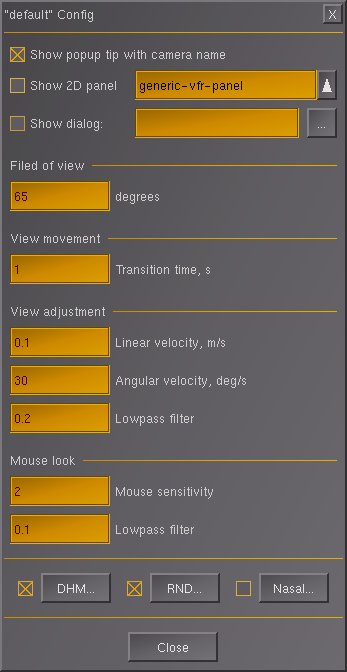
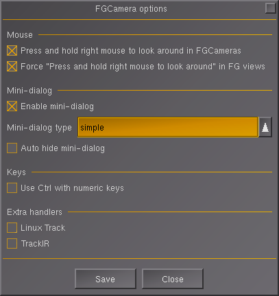
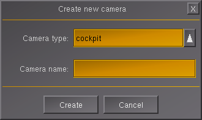
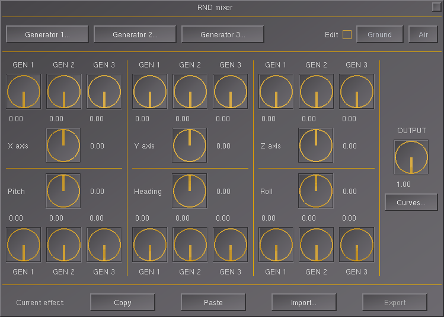
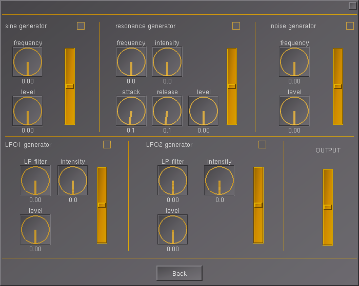

# Add-on usage

FlightGear virtual camera. Written in NASAL. Adds features similar to Ezdok
Camera Addon for FSX. User can define it's own view configuration (position
inside/outside the aircraft, look-at and zoom). One can switch between them
using keyboard shortcuts 0-9.

FGCamera covers also dynamic head movement according to defined values and random
movement generator which can simulate any aircraft type (GA, Airliner etc).

# Installation

- extract zip (if downloaded as a zip) to a given location. For example let's
  say we have `/myfolder/addons/fgcamera` with contents of this addon.
- add path to the addon in the Launcher application in 'Add-On' section **OR**
  run FlightGear with `--addon` option with path to FGCamera like
  `--addon="/myfolder/addons/fgcamera"`.

# FlightGear configuration

Start FlightGear. Go to menu `View -> FGCamera`. FGCamera default configuration
window will appear.

FGCamera configuration can:

* show generic options for FGCamera by select 'Options...' button,
* copy selected camera configuration using 'Copy camera' button. You have to select any
  predefined camera first,
* create new camera config using 'Create new camera...' button.

In the next panel, FGCamera lists all camera configurations with it's camera
shortcut and default camera group. In the example we have 'default' camera, which
is connected with the `1` key on the keyboard. The default camera is in the group
`[0]`. The arrow sign `<-` indicates the currently selected camera.

You can change order of the selected camera by using buttons 'Up' and 'Down'.

In the bottom you have:
* input field to change the current name of the selected camera,
* input field to change current group of the camera,
* 'Config...' button to access current camera configuration,
* 'Delete' button to delete the selected camera.

## General options

Clicking 'Options...' button you can define behavior of following options:

* Mouse
  * `Press and hold right mouse to look around in FGCamera` - FGCamera changes
  the right mouse button behavior to 'Click right mouse to cycle mouse behavior'
  (see `File -> Mouse Configuration`). Therefore, check this option if you want
  to look around while holding down the right mouse button. By default, this
  option is enabled.
  * `Force "Press and hold right mouse to look around" in FG views` - Using
  FGCamera, you can always switch to FlightGear's default views using the v/V
  key.  Check this option if you would like to look around in this mode by
  holding  down the right mouse button. By default, this option is enabled.
* Mini-dialog
  * `Enable mini-dialog` - enable/disable displaying the mini-dialog, in the
  lower left corner of the screen. Enabled by default.
  * `Mini-dialog type` - you can choose a 'simple' mini-dialog or 'slots'
  which additionally includes 0 to 9 buttons for changing cameras. By default,
  'simple' mini-dialog is using.
  * `Auto hide mini-dialog` - enabling this option will cause that by default
  the mini-dialog will be hidden, only pointing the mouse cursor to the lower
  left corner of the screen will display the mini-dialog. By default, this
  option is disable.
* Key
  * `Use Ctrl with numeric key` - by default, FGCamera overrides the default
  number key assignments, 0 to 9, using them to switch between cameras. This
  means you won't be able to use the number keys to control the aircraft, such
  as the 5 key to return the controls to neutral position, etc. Then you can
  enable this option to make FGCamera override the number keys with the Ctrl key
  held down. Then FlightGear's default number keys will work, and switching
  between cameras will be done with Ctrl-0 to Ctrl-9. By default, this option is
  disabled.
* Extra handlers - these handlers are optional and most users don't need them,
  so they are disabled by default. However, you can always enable them as needed.
  * `Linux Track` - enable/disable Linux Track handler.
  * `TrackIR` - enable/disable TrackIR handler.

## Mini-dialogs

FGCamera also offers two mini-dialogs to quickly switch between cameras using the mouse.

### 'Simple' mini-dialog

This window contains 4 buttons:

* `<<`, `>>` - these buttons are used to switch between camera groups,
* `<`, `>` - these buttons are used to switch between cameras in the current camera group only,
* `R` - reset button to switch to default camera assigned to key `1`.

### 'Slots' mini-dialog

This window displays the same buttons as the 'simple' variant, plus includes
additional buttons from 0 to 9, with which you can select a specific camera.

## Keyboard shortcuts

* Ctrl-Up / Ctrl-Down - move current camera to forward / backward.
* Ctrl-Left / Ctrl-Right - move current camera to left / right.
* Ctrl-PageUp / Ctrl-PageDown - move current camera to up / down.
* 0, 1, 2, ... 9 - selecting predefined cameras views or Ctrl-0, Ctrl-1, ...
  Ctrl-9 if `Use Ctrl with numeric key` options is enabled.
* Ctrl-Space - toggle aircraft control by mouse.

## Creating new camera

Using 'Create new camera...' brings the default dialog for creating it. There
you can define camera name and select camera type.

Camera types are as follows:

* `cockpit` - view from cockpit
* `aircraft (look at)` - view on aircraft
* `aircraft (look from)` - view from the aircraft to the outside world
* `world (look at)` - any perspective
* `world (look from)` - any perspective

After selecting camera type and its name, the new camera is created. By default
it has camera coordination as current user camera. Thus you can select camera using
Ctrl+{controls} keys and next create camera, which would have this camera as
predefined.

## Camera settings

Camera setting has different options regarding current selected camera. Available
options:

* `Show popup tip` - when selecting it, the popup will show with selected camera name.
* `Show 2D panel` - display 2D panel with the selection of this camera. You can
  also choose between two panels to show (see next paragraph).
* `Show dialog`- display any FG dialog with the selection of this camera. First,
  type the name of the dialog, such as `map` for map display, then check the
  checkbox. To find more dialog names, edit the `gui/menubar.xml` file in your
  FGData directory of your FlightGear installation and search this file for the
  `<dialog-name>` tag. The names putting there are the names of the dialogs you
  can enter to this option.
* `Field of view` - default field of view in degrees. If you want a wider field
  of view, use a larger value. Default is 65 degrees.
* `View movement` - duration of the transition animation (in seconds) from the
  previous camera to the current one. Default is 1 second.
* `View movement/adjustment` - options for selecting/animating transition between
  views.
* `Mouse look` - options for current mouse look (sensitivity etc.)

When selecing 2D panel you can choose between two ready-made panels. One with
default controls/gauges for VFR flight control and one with only physical control
display with throttle.

On the 'Current camera settings' dialog, there are two buttons at the bottom
1. 'DHM' for options regarding 'Dynamic Head Movement'
2. 'RND' for Random movement generator.

## Dynamic Head Movement

When selecting 'DHM' on the camera setting dialog, user is moved to the options
regarding dynamic head movement. There you can define various options regarding
this effect. When enabled and configured the camera will move according to
defined options the same as normally would move the head of the pilot in the
aircraft.

## Random View Generator

When selecting 'RND' on the camera settings dialog, one is moved to the Random
View Generator dialog. There you can define predefined random movement. This
option can simulate various aircrafts and situations. When selecting 'Import'
button, you can import predefined Random setting according to plane types e.g.
for General Aircraft (GA) type. Using Ground/Air buttons you can define different
random generator according to the aircraft state (in Air/on the Ground).

When pressing 'Generator 1...', 2, 3 button you can define additional random
signal generators, that can feed the data to main random generator engine.

When pressing 'Curves' button, you can define additional output gain regarding
velocity in knots.

## Saving changes

Each change in 'Current camera settings' dialog must be confirmed by 'Store position' button. Then the changes will be store for current camera but in the RAM only. To save changes permanently to disk, click the 'Apply' or 'OK' button in the main 'FGCamera' dialog. The 'OK' button simultaneously closes the 'FGCamera' dialog. The 'Apply' button only saves the changes and leaves the 'FGCamera' dialog open.

Every configuration is saved with the current aircraft settings.
Settings regarding each aircraft are stored in
`$FG_HOME/aircraft-data/FGCamera/{aircraft name}/` directory.

# Additional resources

* See `aircraft-integration.md` file for additional API for integration with the
aircraft code in order to get more precise control e.g. walker bypass options
* See `headtracker-integration.md` file for information how to integrate additional
head-tracker interfaces (beside linuxtrack and irtrack)

Have fun using this addon!

